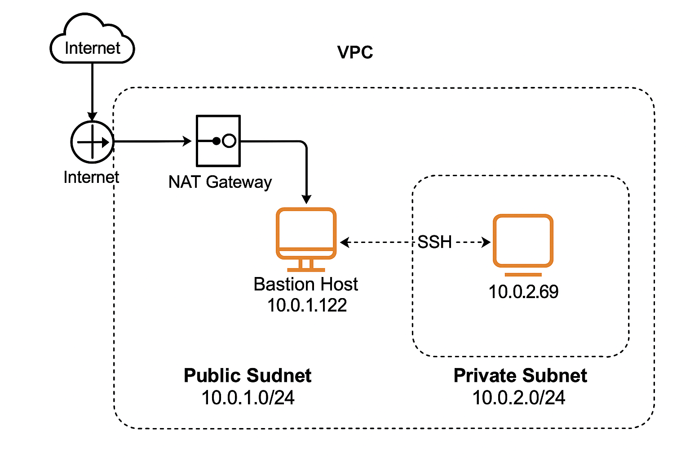

# AWS VPC Hands-on Practice

This project contains my hands-on practice of AWS VPC networking components using the AWS Console.

## 📌 VPC Setup

- **VPC CIDR**: 10.0.0.0/16
- **Public Subnet**: 10.0.1.0/24
- **Private Subnet**: 10.0.2.0/24
- **Internet Gateway (IGW)**: Attached to VPC
- **NAT Gateway**: In public subnet for private subnet egress
- **Bastion Host**: To SSH into private EC2 instances
- **Route Tables**: Configured for proper routing
- **Security Groups & NACLs**: Properly set to allow SSH, HTTP

## 🖼️ Architecture

## ✅ Practice Topics

- Public vs Private Subnets
- NAT vs IGW
- Bastion Host Setup
- Security Group Rules
- Route Table Configuration
Learning AWS VPC with hands-on practice.

